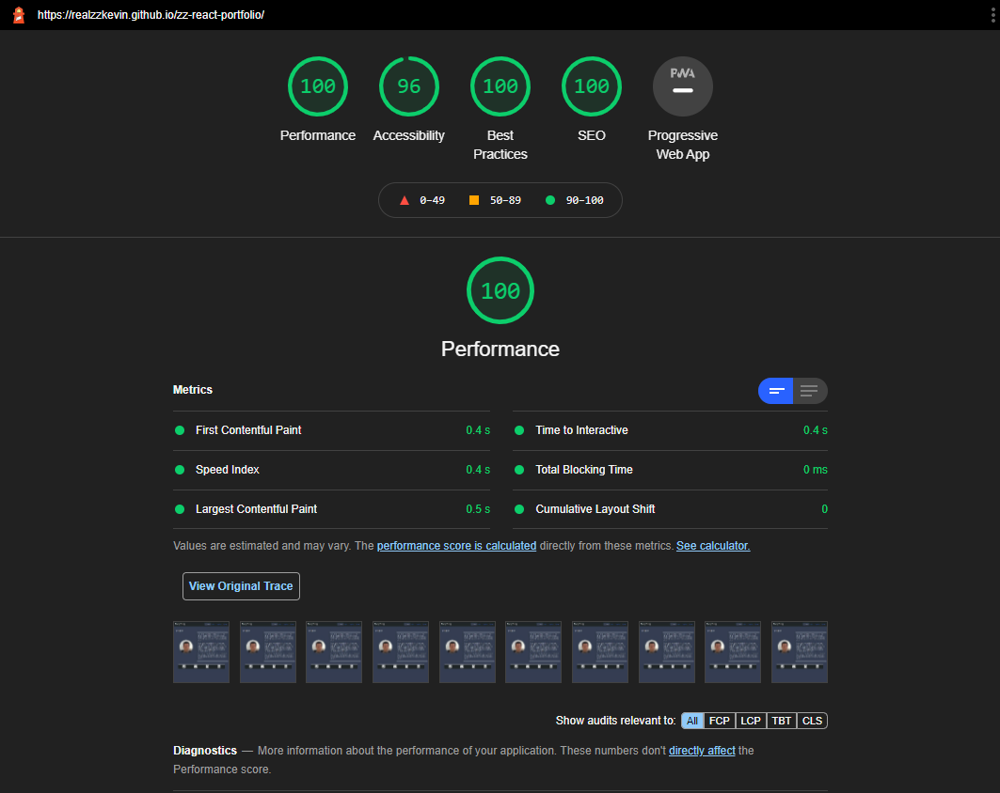

# My Portfolio React Version

## Descriptions 

The goal of this project is to create a webpage to display a professional work portfolio use HTML and CSS language. This portfolio will work as a showcase of my skills and talents to any potential employer. It contains personal information like name, photo, contact information, resumes; and most importantly, a collection of deployed applications. 

This portfolio page has been rewrite use Bootstrap, to improve it's layout, style and funcitonality.

"Update":
This porfolio page has been recreated using React. 

## Table of contents
- [Features](#features)
  
- [Links](#links) 

- [Screenshots](#screenshots) 

- [Credits](#credits)

- [License](#license) 

- [Questions](#questions) 

## Features
- Created use React. 

- Fully responsive design, opitimization layout for various screen sizes and devices

- Contain a collection of links of deployed applications

- Navigation bar can switch from tab style to dropdown menu.

- A carousel to display my works.

- A contact me form.

## Links

[React Portfolio github page](https://github.com/realzzkevin/zz-react-portfolio)

[React Portfolio](https://realzzkevin.github.io/zz-react-portfolio/)

## Screenshots

- About me page

- Works page

- Contact page

- Resume page

- Lighthouse Report

## Credits

[google](https://www.google.com/)

[Bootstrap](https://getbootstrap.com/)

[Css Tricks](https://css-tricks.com/)

## License

This project is licensed under the [mit](./LICENSE) license

## Questions
If you have any questions about the repo, Contact me at [realzzkevin@gmail.com](realzzkevin@gmail.com). You can find more of my works at [realzzkevin](https://github.com/realzzkevin)